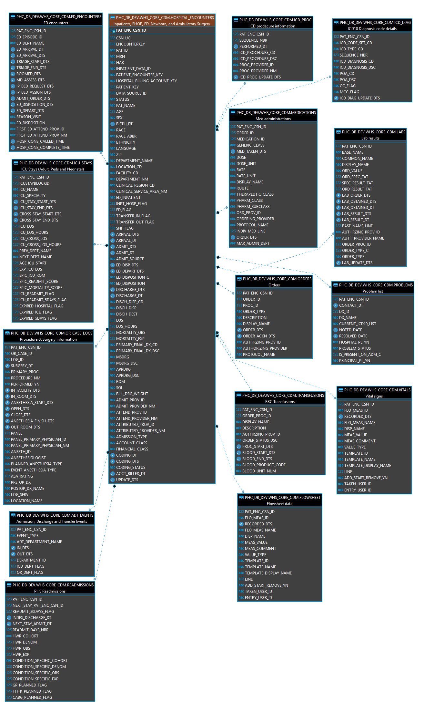

## Example Entity Relationship ER Diagram 

This ER diagram is an example of the CoreCDM data model based on *Proprietary Model A*. Refer to the [ER Diagram]() 
page for a version based on MIMI-IV data. 

  

# README 

This repository is used to construct the [CoreCDM]() website and to the build 
a minimal CoreCDM version using MIMIC-IV data and DuckDB.

CoreCDM is a clinical data model designed for strategic/ad-hoc analytics, 
which significantly decreases complexity and number of table joins and development time.


## Building CoreCDM using DuckDB

This is an adaptation of the [MIMIC-IV DuckDB installation method](https://github.com/MIT-LCP/mimic-code/tree/main/mimic-iv/buildmimic/duckdb)  found in the MIMIC-IV code repository.

Prior to starting, you'll need to know:  
- the location of the MIMIC-IV data directory `Data/mimic_iv/*`
- the location of the DuckDB database file `Data/CoreCDM.db`

1. [Install](https://duckdb.org/docs/installation/) the DuckDB CLI application
1. Download the [MIMIC-IV demo](https://physionet.org/content/mimic-iv-demo/2.2/) data files. Alternatively, you can download the [full MIMIC-IV dataset](https://physionet.org/content/mimiciv/2.0/), if you have access.  

```
wget -r -N -c -np https://physionet.org/files/mimic-iv-demo/2.2/ \
-P ./Data/mimic_iv
```
This will make your mimic_data_dir be `Data/mimic_iv` under the current working directory.

```
mimic_data_dir
    hosp
        admissions.csv.gz
        ...
        transfers.csv.gz
    icu
        chartevents.csv.gz
        ...
        procedureevents.csv.gz
```
1. Run `import_duckdb.sh`- Imports the MIMIC-IV data files.
1. Run `setup_coreCDM.sh`- Creates the CoreCDM schema and tables.

When complete, you'll have a single DuckDB database file containing both the MIMIC-IV and CoreCDM data tables.
